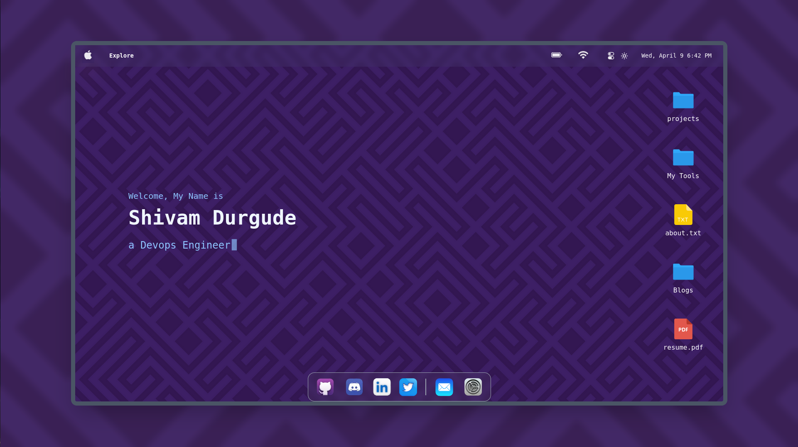
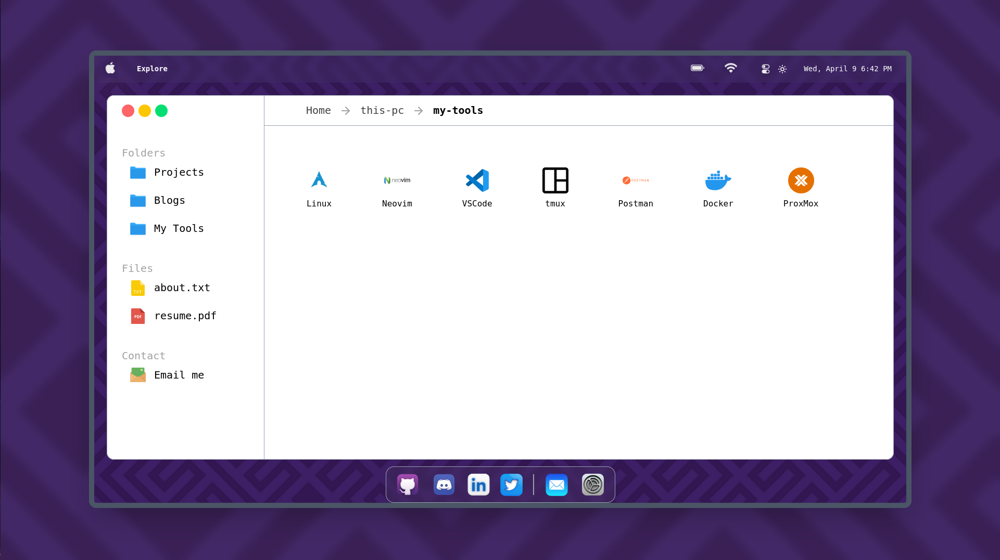
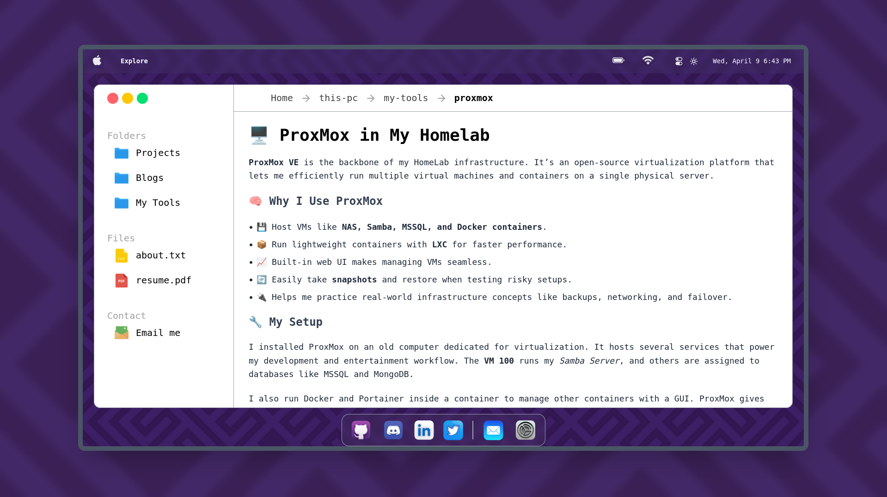

# 🖥️ My Portfolio — "This PC"

A modern, macOS-style portfolio built with **Next.js 15**, inspired by the nostalgia of "This PC" or a system desktop. Designed to creatively showcase who I am, what I’ve built, and the tools I love.

---

## Screenshots

---

## ✨ Features

- 📁 macOS-inspired folder-style navigation  
- 🧠 Blogs with Markdown and syntax-highlighted code blocks  
- 🛠️ Dedicated pages for tools I use (like Arch, Docker, Proxmox, etc.)  
- 📄 Dynamic routes for blog/projects (`/this-pc/blogs/[slug]`, `/this-pc/projects/[slug]`)  
- 🌙 Dark mode support  

---

## ⚙️ Technologies Used

- **Next.js 15 (App Router)**
- **React 18**
- **TypeScript**
- **Tailwind CSS**
- **Shadcn/UI**
- **Framer Motion**
- **React Markdown** + `remark-gfm`, `rehype-raw`, `rehype-sanitize`
- **Prism.js** or `react-syntax-highlighter`
- **Auth0**
- **Docker**
- **Proxmox**

---

## 🧠 What I Learned

- ✅ Leveraging the **Next.js App Router** to build file-based routing with layouts and loading states.
- ✅ Setting up **dynamic static pages** with `generateStaticParams()` and optimizing SEO.
- ✅ Handling **Markdown parsing securely** using `rehype-sanitize`.
- ✅ Using **Tailwind CSS + Shadcn/UI** to maintain consistent styling with minimal code.
- ✅ Containerizing the full stack with **Docker** for easier deployment.
- ✅ Improving accessibility and responsiveness through semantic HTML and layout tweaks.
- ✅ Hosting and managing services on **Proxmox** as part of a home lab.

---

## 📬 Contact

If you have questions, feedback, or just want to connect:

📧 [Shivamdurgude1@gmail.com]  
🌐 [devsh.tech](https://portfolio-one-navy-57.vercel.app/)  
🐙 [GitHub](https://github.com/sd191100)
