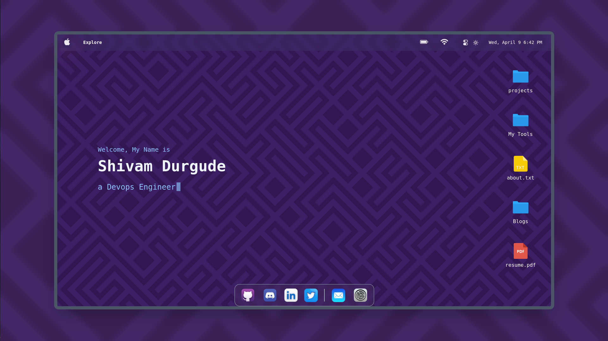
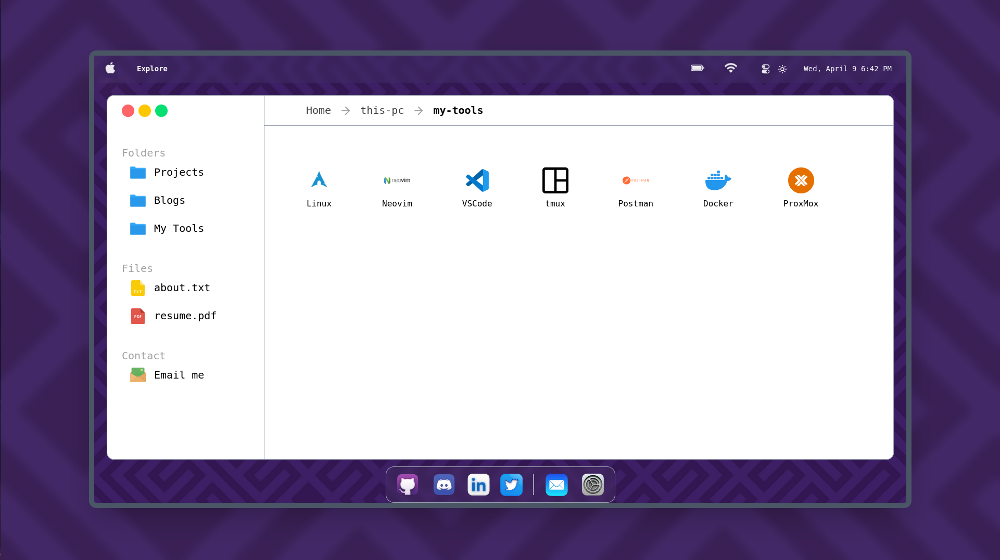
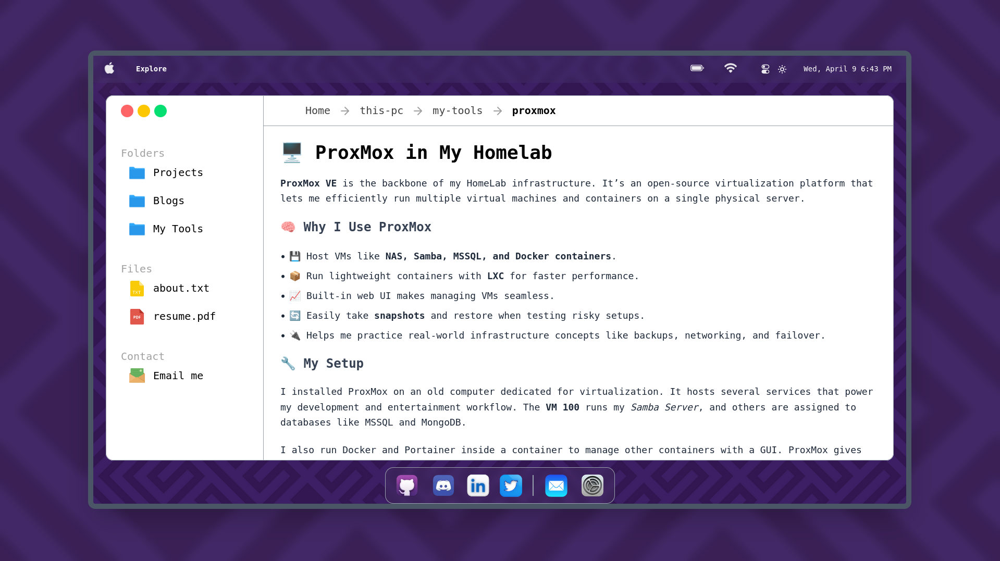

# My Portfolio — "This PC"

I got tired of seeing the same portfolio layouts everywhere, so I decided to build something a little different.

This portfolio is inspired by the old **"This PC"** experience, mixed with a macOS-style desktop. Instead of clicking through sections, you explore folders, open files, and navigate around like you're using an actual computer.

It was a fun project that gave me a chance to experiment with the Next.js App Router while building something that actually feels like me.

---

## Screenshots

---

## Features

- Desktop-inspired interface instead of a traditional portfolio
- Blog posts written in Markdown with syntax highlighting
- Pages for the tools I use, including Arch Linux, Docker, and Proxmox
- Dynamic routes for blogs and projects
- Dark mode support
- Smooth animations to make navigation feel more natural

---

## Tech Stack

- Next.js 15
- React
- TypeScript
- Tailwind CSS
- Shadcn/UI
- Framer Motion
- React Markdown
- remark-gfm
- rehype-raw
- rehype-sanitize
- Prism.js / react-syntax-highlighter
- Auth0
- Docker
- Proxmox

---

## What I Learned

This project helped me get more comfortable with several parts of the modern React ecosystem.

Some of the things I learned along the way include:

- Working with the Next.js App Router and nested layouts
- Creating dynamic pages with `generateStaticParams()`
- Rendering Markdown safely using `rehype-sanitize`
- Building reusable components with Tailwind CSS and Shadcn/UI
- Containerizing the application with Docker
- Making the interface responsive while keeping the desktop-inspired design
- Hosting and managing the project on my Proxmox home server

There are still things I'd like to improve, but that's part of building projects and learning as I go.

---

## Contact

If you have any feedback, find a bug, or just want to connect, feel free to reach out.

- **Email:** [shivamdurgude1](mailto:Shivamdurgude1@gmail.com)
- **Portfolio:** [shivam.cc](https://shivam.cc)
- **GitHub:** [github@SD191100](https://github.com/sd191100)

-- 

Check out my **blog** at [shivam.cc/blog](https://blog.shivam.cc)
